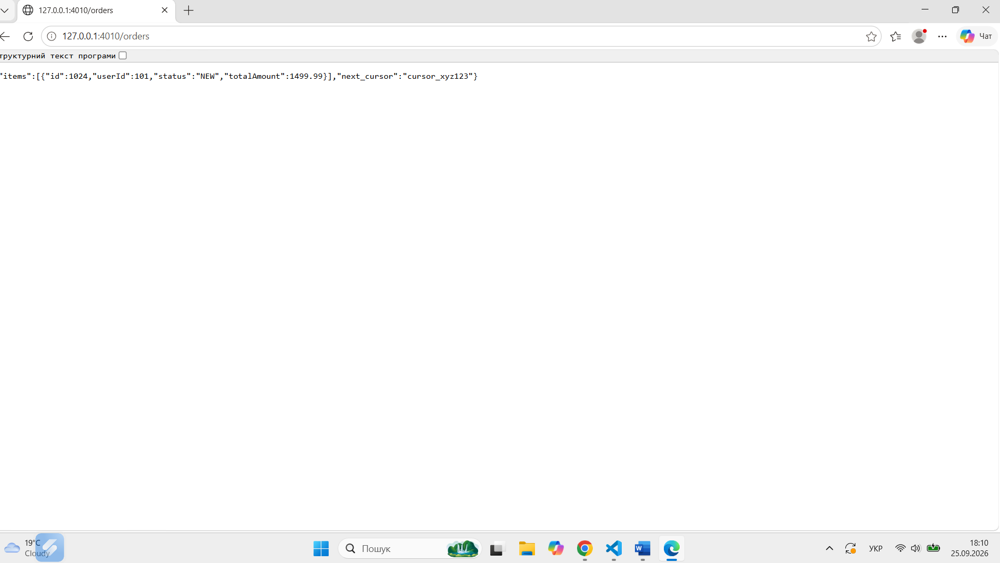

# Звіт про виконання лабораторної роботи №3
## Тема: Проєктування та специфікація API (REST OpenAPI 3.0 та gRPC Proto3)

**Студент:** Семеніхін Руслан  
**Група:** 3ПР1  
**Тег у репозиторії:** lr3  
**Посилання на репозиторій:** [https://github.com/Madamada2026/my-architecture-project](https://github.com/Madamada2026/my-architecture-project)  

---

### 1. Архітектурне позиціонування інтерфейсів

У межах розроблюваної системи E-Commerce Cloud Platform чітко розділено рівні мережевої взаємодії:
- **Публічний REST API (OpenAPI 3.0.3):** Призначений для зовнішньої взаємодії з клієнтськими застосунками (Single Page Applications (SPA), вебфронтенд, мобільні додатки). Забезпечує високу сумісність, зрозумілість, використання стандартного протоколу HTTP/1.1 та строго типізовану обробку помилок за RFC 7807.
- **Внутрішній gRPC API (Protocol Buffers v3):** Застосовується для високошвидкісної, високонавантаженої міжсервісної взаємодії (Microservice-to-Microservice) усередині контуру системи (наприклад, OrderService -> InventoryService / BillingService). Використовує бінарну серіалізацію та транспорт HTTP/2, що мінімізує затримку (Network Latency) та навантаження на мережу.

---

### 2. Специфікація REST API (OpenAPI 3.0)

* **Посилання на файл специфікації:** [`api/openapi.yaml`](./api/openapi.yaml)

#### Опис кінцевих точок (Endpoints) та методів:
* `POST /orders` — створення нового замовлення (приймає JSON `CreateOrderRequest`, повертає `201 Created` з об'єктом замовлення).
* `GET /orders/{id}` — отримання деталей замовлення за ідентифікатором (повертає `200 OK` або `404 Not Found`).
* `DELETE /orders/{id}` — скасування замовлення за ідентифікатором (повертає `200 OK` із підтвердженням).

#### Застосування стандарту RFC 7807 (Problem Details for HTTP APIs):
Для уніфікації відповідей про помилки описано схему `ProblemDetails` з обов'язковими полями: `type` (URI помилки), `title` (короткий опис), `status` (HTTP код), `detail` (деталі помилки) та `instance` (URI запиту). 

#### Скріншот працездатності Prism Mock Server:
Для локального тестування REST API без написання бекенду було запущено Prism Mock Server командою `npx @stoplight/prism-cli mock api/openapi.yaml -p 4010` та виконано перевірочні запити.



---

### 3. Специфікація gRPC API (Protocol Buffers v3)

* **Посилання на файл специфікації:** [`api/service.proto`](./api/service.proto)

#### Опис сервісу, RPC-методів та структур повідомлень:
У сервісі `InternalOrderService` описано міжсервісну взаємодію із застосуванням строгої типізації Proto3, унікальних числових тегів полів та перелічень enum:
* `CreateOrder` (Unary RPC) — приймає `CreateOrderRequest`, повертає `OrderResponse`.
* `CancelOperation` (Unary RPC) — приймає `CancelOperationRequest`, повертає `CancelOperationResponse`.
* `StreamOrderStatus` (Server Streaming RPC) — приймає `StreamOrderStatusRequest`, повертає потік `OrderStatusUpdate`.

**Ключові структури передаваних повідомлень:**
* `Order` — основна доменна сутність (поля: `id` (int64), `user_id` (int64), `items` (repeated OrderItem), `total_amount` (double), `status` (OrderStatus), `metadata` (KhNTUAuditMetadata)).
* `OrderItem` — позиція замовлення (поля: `product_id` (int64), `quantity` (int32), `unit_price` (double)).
* `OrderStatus` — enum станів (`ORDER_STATUS_UNSPECIFIED = 0`, `NEW = 1`, `PROCESSING = 2`, `COMPLETED = 3`, `CANCELLED = 4`).
* `KhNTUAuditMetadata` — метадані аудиту системних запитів (`trace_id`, `created_at`).

#### Фрагмент / скріншот успішної генерації стабів:
Виконано команду генерації TypeScript/JavaScript типізованих стабів у середовищі Windows CMD:
```cmd
npx proto-loader-gen-types --longs=String --enums=String --defaults --oneofs --grpcLib=@grpc/grpc-js --outDir=api/generated api/service.proto
```

---

### 4. Порівняльний аналіз (JSON vs Protobuf Benchmark)

#### Таблиця розміру корисного навантаження (Payload Benchmark):
Вимірювання проводилося для洍днакової доменної сутності `Order` (5 позицій товарів, адреса delivery, метадані аудиту):

| Формат / Протокол | Розмір у байтах | Коефіцієнт стиснення (Wire Efficiency) |
| :--- | :--- | :--- |
| **JSON (Text / Compact)** | **485 B** | 100% (Базовий розмір) |
| **Protobuf v3 (Binary)** | **142 B** | **~70.7% економії трафіку** (3.41x менше) |

#### Висновки щодо компромісів (Trade-offs):
* **Швидкість (CPU Overhead):** Protobuf серіалізується/десеріалізується значно швидше за JSON завдяки прямому бінарному кодуванню за числовими тегами без накладних витрат на парсинг текстових ключів та дужок.
* **Пам'ять (Memory Efficiency):** Завдяки компактному Varint-кодуванню числових типів та відсутності текстових імен полів у мережевому потоці (wire format) бінарне навантаження Protobuf займає у 3–4 рази менше RAM та мережевого буфера.
* **Читабельність (Human Readability):** JSON є текстовим і легким для відлагодження у Postman/браузері. Protobuf — бінарний, вимагає `.proto` схеми для декодування, але дає високу ефективність передачі.
* **Еволюція схем:** Завдяки нумерації тегів у Proto3 досягається сумісність назад і вперед (Backward & Forward Compatibility) без порушення роботи наявних клієнтів.

---

### 5. Висновки

Під час виконання лабораторної роботи №3 повністю опановано підхід **Contract-First** для проєктування REST (OpenAPI 3.0) та gRPC (Proto3) інтерфейсів. На практиці реалізовано специфікацію OpenAPI з типізацією помилок RFC 7807, налаштовано мокінг через Prism Mock Server, створено gRPC-схему та згенеровано TypeScript-стаби. На основі проведеного порівняльного аналізу доведено переваги Protobuf для мікросервісної взаємодії.

За результатами роботи успішно сформовано програмні компетентності:
* **ПРН17** — вміння проєктувати інтерфейси взаємодії API, будувати схеми OpenAPI/gRPC та застосовувати стандарти специфікації контрактувань;
* **ФК03** — здатність здійснювати архітектурне моделювання міжсервісної взаємодії, обирати оптимальні мережеві протоколи (HTTP/1.1 vs HTTP/2) та формати передачі даних (JSON vs Protobuf).
