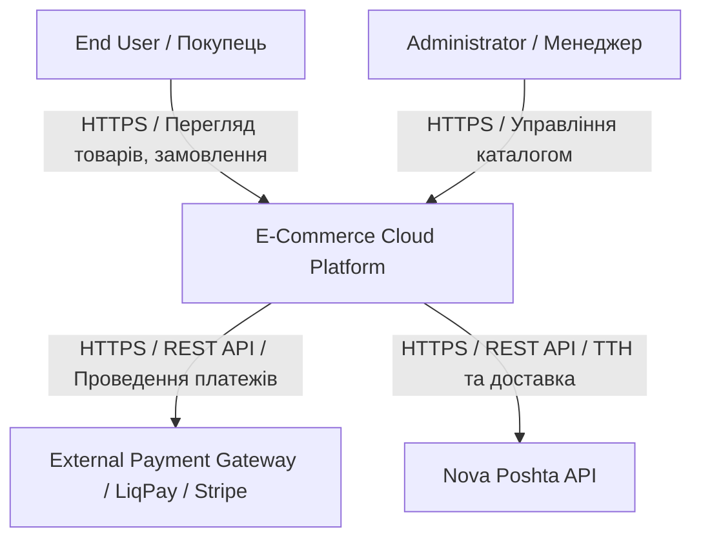
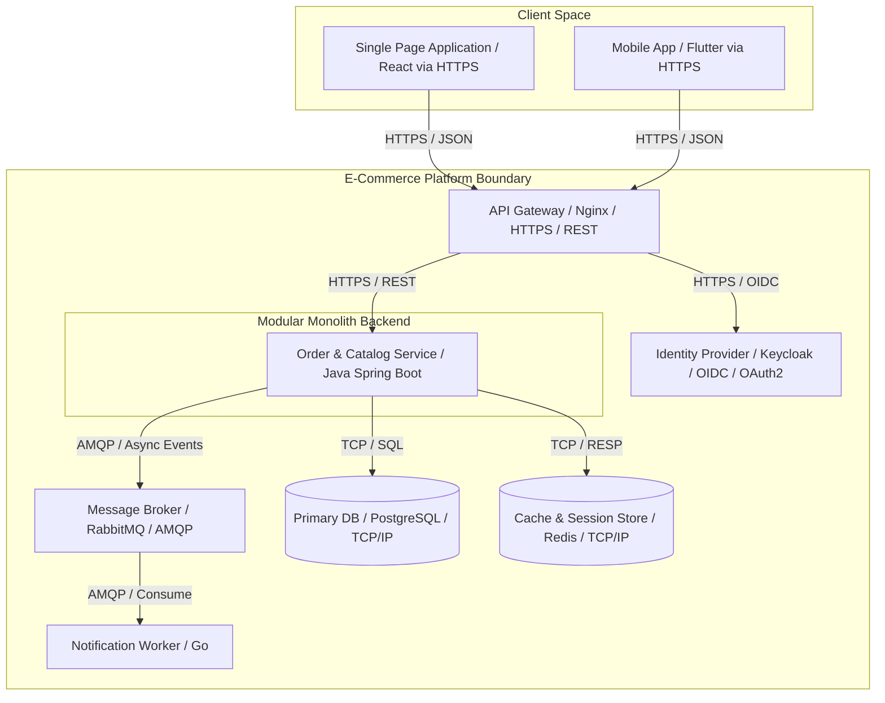
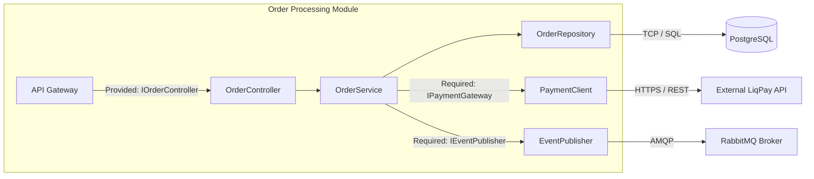
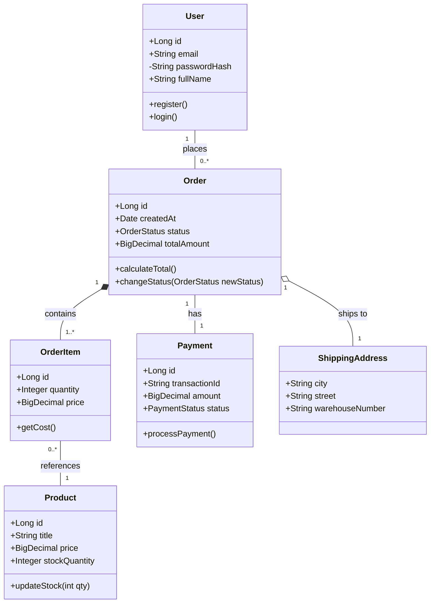
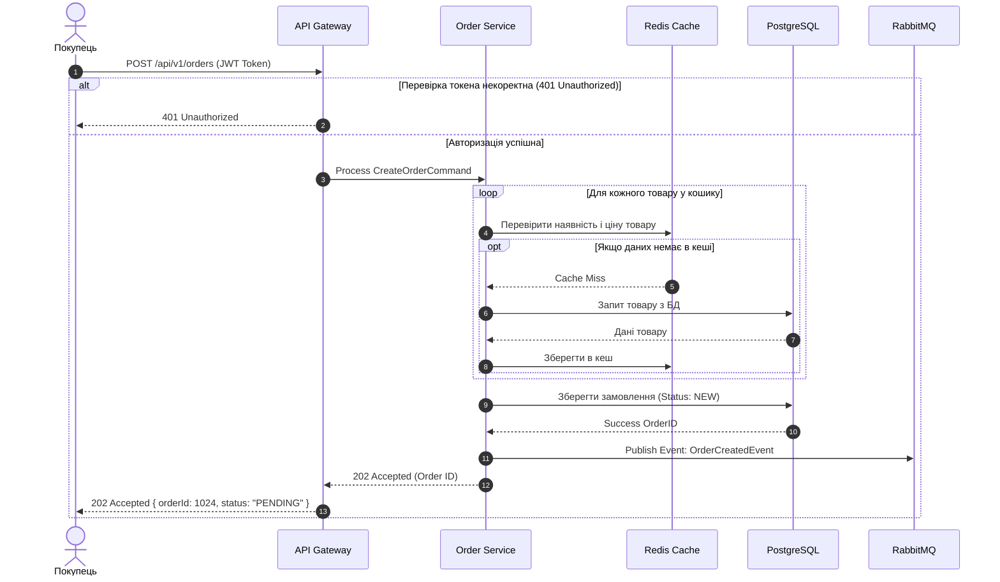
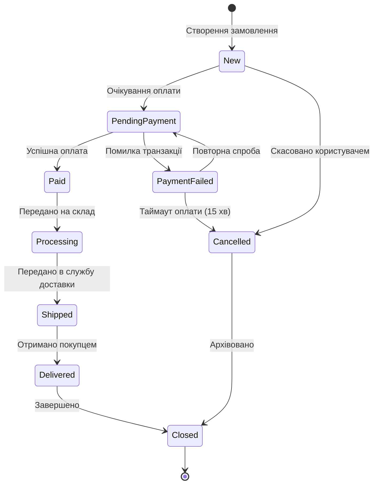

# Звіт з Лабораторної роботи №2
**Тема:** Побудова C4 Model, UML-моделювання статичної структури та динаміки поведінки (MILESTONE 2)
**Варіант:** № 1 — E-Commerce Cloud Platform

---

## Розділ 1: C4 Model (Level 1 Context & Level 2 Container)

### 1.1 C4 Level 1: System Context Diagram
Діаграма відображає місце системи E-Commerce Cloud Platform у зовнішньому оточенні та взаємодію зі стейкхолдерами та зовнішніми сервісами.

### 1.2 C4 Level 2: Container Diagram
Розбиття системи на окремі технічні контейнери із зазначенням конкретних мережевих протоколів комунікації.

---

## Розділ 2: UML Component Diagram & UML Class Diagram

### 2.1 UML Component Diagram (C4 Level 3)
Архітектура внутрішнього backend-модуля (Modular Monolith) із зазначенням надаваних (Provided) та запитуваних (Required) інтерфейсів.

### 2.2 UML Domain Class Diagram
Предметна область системи, що включає більше 5 основних сутностей з атрибутами, методами, типами доступу та кратністю.

---

## Розділ 3: UML Sequence Diagram & State Machine Diagram

### 3.1 UML Sequence Diagram
Сценарій створення замовлення під час високого навантаження із застосуванням комбінованих фрагментів `alt`, `opt` та `loop`.

### 3.2 UML State Machine Diagram
Життєвий цикл головної сутності домену — **Замовлення (Order)**.

