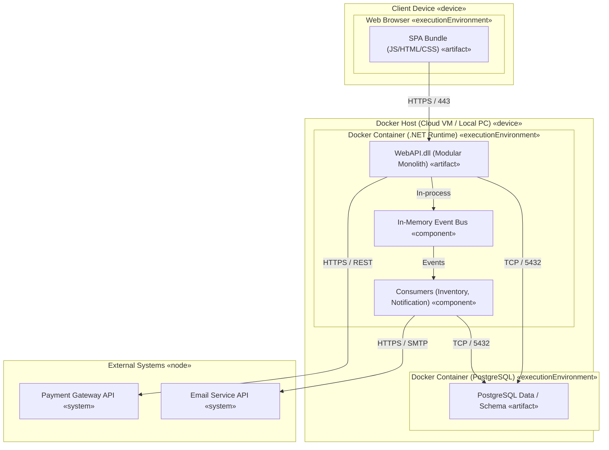

```mermaid
graph TD
    subgraph Client ["Client Device «device»"]
        subgraph Browser ["Web Browser «executionEnvironment»"]
            SPA["SPA Bundle (JS/HTML/CSS) «artifact»"]
        end
    end

    subgraph DockerHost ["Docker Host (Cloud VM / Local PC) «device»"]
        subgraph AppContainer ["Docker Container (.NET Runtime) «executionEnvironment»"]
            WebAPI["WebAPI.dll (Modular Monolith) «artifact»"]
            Bus["In-Memory Event Bus «component»"]
            Consumers["Consumers (Inventory, Notification) «component»"]

            WebAPI -->|In-process| Bus
            Bus -->|Events| Consumers
        end

        subgraph DBContainer ["Docker Container (PostgreSQL) «executionEnvironment»"]
            Database["PostgreSQL Data / Schema «artifact»"]
        end
    end

    subgraph External ["External Systems «node»"]
        Payment["Payment Gateway API «system»"]
        Email["Email Service API «system»"]
    end

    SPA -->|HTTPS / 443| WebAPI
    WebAPI -->|TCP / 5432| Database
    Consumers -->|TCP / 5432| Database
    WebAPI -->|HTTPS / REST| Payment
    Consumers -->|HTTPS / SMTP| Email
```
